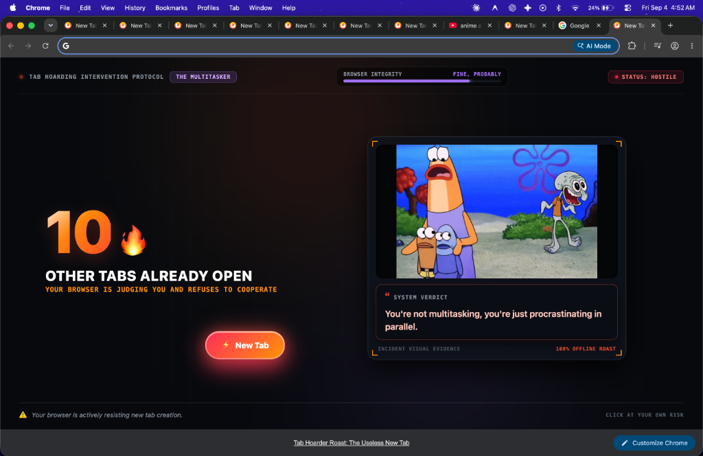
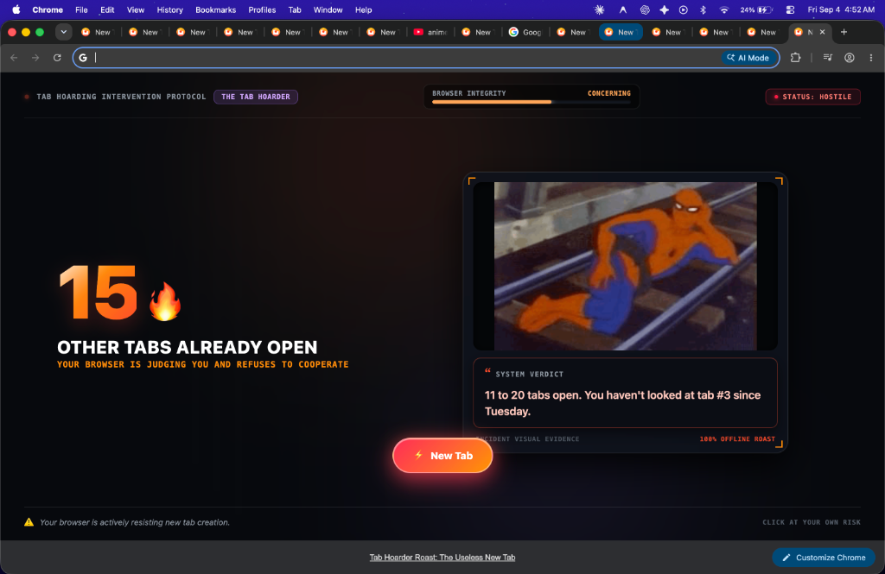
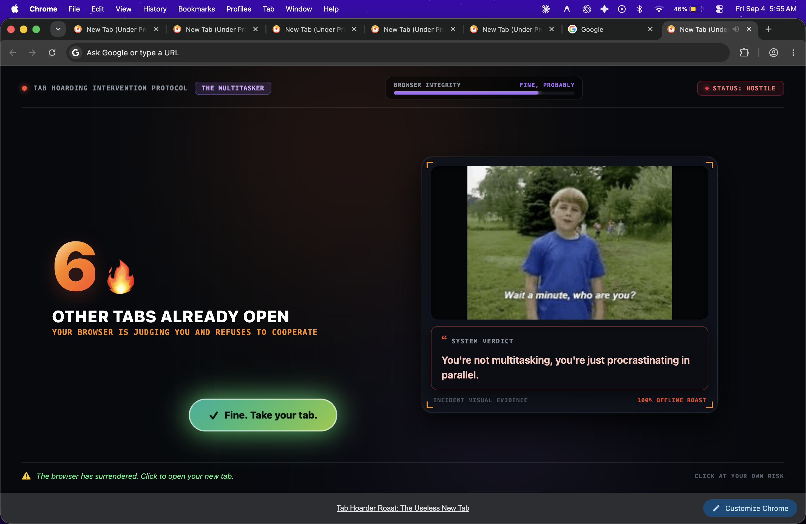

# Useless New Tab Roaster 💀


## Basic Details
### Team Name: Null point


### Team Members
- Team Lead: Adithyan Suresh - Model Engineering college
- Member 2: Adisesh - Model engineering college

### Project Description
Useless New Tab Roaster is a humorous Chrome Manifest V3 extension that turns the otherwise ordinary New Tab page into an interactive browser “incident report” that roasts users for their tab-hoarding habits.
The project is designed around a simple idea: your browser should judge you for having too many tabs open.

### The Problem (that doesn't exist)
Modern browsers make it incredibly easy to accumulate tabs.
Eventually, your browser looks less like a workspace and more like a digital archaeological site.
Yet Chrome simply sits there silently judging you.

### The Solution (that nobody asked for)
Useless New Tab Roaster is a deliberately unnecessary Chrome extension that turns your excessive tab count into memes, sarcastic roasts, evasive buttons, sound effects, and optional AI-powered humiliation.

## Technical Details
### Technologies/Components Used
For Software:
- HTML,CSS,Javascript,json
- No major frontend framework is used.
- Antigravity and chatgpt


### Implementation
For Software:
# Installation
1. Clone the repository:
   ```bash
   git clone https://github.com/adithyansuresh2006/useless_project.git
   cd useless_project
   ```
2. (Optional for AI roasts) Set up the server environment:
   ```bash
   # Add OPENROUTER_API_KEY to server/.env if using AI roasts
   ```

# Run
1. Open Google Chrome and navigate to `chrome://extensions/`.
2. Enable **Developer mode** in the top right corner.
3. Click **Load unpacked** and select the `useless_project` directory.
4. Open a New Tab to experience the roaster!
5. (Optional) Run the local AI server:
   ```bash
   node server/server.js
   ```

### File Structure
```
useless_project/
├── manifest.json              # Chrome Manifest V3 configuration & permissions
├── newtab.html                # Poster UI layout & Incident Report stage
├── newtab.css                 # Cyber-poster aesthetic, typography & evasive styles
├── newtab.js                  # Tab counting, evasion state machine & audio controller
├── No.mp3                     # Non-final evasion sound effect
├── Yes.mp3                    # Final surrender sound effect
├── assets/
│   ├── icons/                 # Extension icons (16px, 48px, 128px)
│   └── memes/
│       ├── gallery/           # Curated collection of user GIFs and JPEGs
│       ├── range_0_5/         # Minimalist tier fallback pixel memes
│       ├── range_6_10/        # Multitasker tier fallback pixel memes
│       ├── range_11_20/       # Tab Hoarder tier fallback pixel memes
│       ├── range_21_30/       # RAM Destroyer tier fallback pixel memes
│       ├── range_31_50/       # Digital Chaos tier fallback pixel memes
│       └── range_51_plus/     # Meltdown tier fallback pixel memes
├── screenshots/               # Demonstration captures for documentation
├── server/
│   ├── server.js              # Standalone Node.js proxy for OpenRouter AI roasts
│   └── .env                   # Secret isolation (never exposed to browser)
├── ARCHITECTURE.md            # Technical specifications & design rules
└── README.md                  # Project documentation & setup guide
```

### Project Documentation
For Software:

# Screenshots (Add at least 3)

*Live Tab Count & Dynamic Visual Evidence:*
*Real-time current-window tab counting paired with contextual memes and instant roasts.*


*Tab Hoarder Tier & Escalated Roasts:*
*Custom tier progression displaying hilarious visual incident reports as open tabs increase.*


*Exhausted Button State & Surrender Interaction:*
*After evading clicks up to a hidden random limit, the button surrenders and enables normal navigation.*

# Diagrams

*Add caption explaining your workflow*


# Build Photos

*List out all components shown*


*Explain the build steps*


*Explain the final build*

### Project Demo
# Video
[Add your demo video link here]
*Explain what the video demonstrates*

# Additional Demos
[Add any extra demo materials/links]

## Team Contributions
- Adithyan Suresh : [Specific contributions]
- [Name 2]: [Specific contributions]
- [Name 3]: [Specific contributions]

---
Made with ❤️ at TinkerHub Useless Projects 


