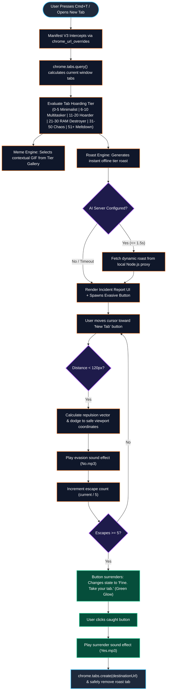
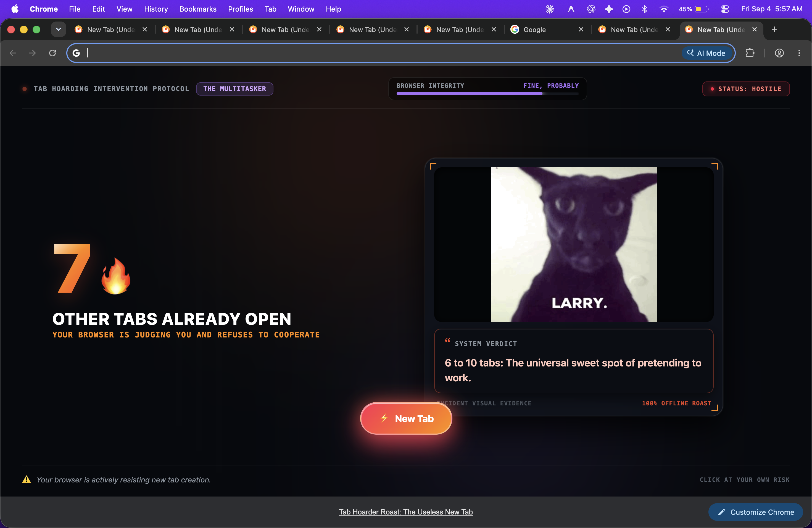

<div align="center">


# 💀 Useless New Tab Roaster
### *Because your browser should judge you for having too many tabs open.*

[](https://developer.chrome.com/docs/extensions/mv3/)
[](#)
[](#)
[](https://tinkerhub.org/events/1M8ORET9A1/useless-projects-3.0)
[](#)

</div>

---

## 📌 Basic Details

### Team Name: `Null point`

### 👥 Team Members
- 👑 **Team Lead:** **Adithyan Suresh** — *Government Model Engineering College*
- 🤝 **Member 2:** **Adisesh S** — *Government Model Engineering College*

---

## 📖 Project Overview

### 🧐 The Problem (that doesn't exist)
Modern web browsers make opening tabs effortlessly seamless. A single search query becomes five tabs; a documentation lookup spawns twelve more; a shopping session consumes twenty. Eventually, your browser tab strip looks less like an active workspace and more like a digital archaeological dig site of forgotten intentions. Yet Chrome quietly sits there, letting you burn gigabytes of RAM in blissful denial.

### 💡 The Solution (that nobody asked for)
**Useless New Tab Roaster** is a deliberately unhelpful, comedic Chrome Manifest V3 extension that hijacks your standard New Tab page and converts it into a high-stakes **"Tab Hoarding Intervention Protocol"**. 

Every time you try opening a new tab, your browser tallies your open tabs in the current window, diagnoses your hoarding severity, pulls up contextual meme evidence, roasts your habits with pinpoint sarcasm, and drops a slippery **"New Tab" button that physically runs away from your mouse cursor**. Only after enduring 5 evasions will the button surrender and let you proceed.

---

## ✨ Key Features

- 🔥 **Real-Time Tab Counting:** Instantly calculates open tabs in the current window without requesting intrusive history permissions.
- 🎭 **Tier-Based Humiliation System:** Escalating severity tiers ranging from *"The Minimalist"* (0–5 tabs) to *"Browser Meltdown"* (51+ tabs) with custom color themes and status indicators.
- 🖼️ **Dynamic Incident Evidence (Memes):** Automatically pairs your hoarding tier with curated, hilarious GIFs and pixel memes.
- 🤖 **Local-First Roaster (with Optional AI):** 100% operational offline with a vast database of witty roasts, plus an optional Node.js proxy for LLM-powered insults via OpenRouter.
- 🧲 **Physics-Based Cursor Evasion:** An evasive button powered by proximity vector math that dodges cursor approaches (`< 120px`), clamps safely inside the viewport, and plays taunting sound effects.
- 🏳️ **Surrender State Machine:** After 5 failed catch attempts, the button tires out, turns green, plays a victory sound, and safely routes to your destination while terminating the roaster tab.

---

## 🛠️ Technical Details

### Technologies & Components
| Category | Technologies / Tools |
| :--- | :--- |
| **Extension Architecture** | Chrome Manifest V3 (`chrome_url_overrides`, `chrome.tabs`) |
| **Frontend Core** | Vanilla HTML5, Modern CSS3 (Cyber-poster aesthetics, glassmorphism, glowing micro-animations), ES6+ JavaScript |
| **Audio Engine** | Native HTML5 Audio API (`No.mp3` for evasions, `Yes.mp3` for surrender) |
| **Optional Backend** | Node.js, Express, OpenRouter API (Isolated `.env` proxy) |
| **Assistance & Tools** | Antigravity IDE, ChatGPT |

---

## 📐 System Architecture & Workflow

### Workflow Diagram



*Figure 1: Full lifecycle workflow of the Useless New Tab Roaster extension.*

---

## 📁 File Structure

```
useless_project/
├── manifest.json              # Chrome Manifest V3 configuration & permissions
├── newtab.html                # Poster UI layout & Incident Report stage
├── newtab.css                 # Cyber-poster aesthetic, typography & evasive styles
├── newtab.js                  # Tab counting, evasion state machine & audio controller
├── No.mp3                     # Non-final evasion sound effect
├── Yes.mp3                    # Final surrender sound effect
├── assets/
│   ├── icons/                 # Extension icons (16px, 48px, 128px)
│   └── memes/
│       ├── gallery/           # Curated collection of user GIFs and JPEGs
│       ├── range_0_5/         # Minimalist tier fallback pixel memes
│       ├── range_6_10/        # Multitasker tier fallback pixel memes
│       ├── range_11_20/       # Tab Hoarder tier fallback pixel memes
│       ├── range_21_30/       # RAM Destroyer tier fallback pixel memes
│       ├── range_31_50/       # Digital Chaos tier fallback pixel memes
│       └── range_51_plus/     # Meltdown tier fallback pixel memes
├── screenshots/               # Demonstration captures & walkthrough video
│   ├── screenshot1.png        # Multitasker Tier (10 tabs)
│   ├── screenshot2.png        # Tab Hoarder Tier (15 tabs)
│   ├── screenshot3.png        # Surrender & exhausted button state
│   ├── screenshot4.png        # Multitasker Tier (7 tabs)
│   └── demo.mp4               # Full project demonstration video
├── server/
│   ├── server.js              # Standalone Node.js proxy for OpenRouter AI roasts
│   └── .env                   # Secret isolation (never exposed to browser)
├── ARCHITECTURE.md            # In-depth technical specifications & design rules
└── README.md                  # Project overview & documentation
```

---

## 📸 Screenshots

<div align="center">

### 1. Tab Hoarding Intervention Protocol (7 Tabs)

*Displays real-time tab count, hostile status badge, curated "Larry" meme evidence, and initial evasive button state.*

<br/>

### 2. Multitasker Tier & Sarcastic Verdict (10 Tabs)

*Contextual dynamic meme evidence and instant offline roast targeting procrastination habit.*

<br/>

### 3. Escalated Tab Hoarder Tier (15 Tabs)

*Browser integrity status drops to "CONCERNING" with increased severity roasts as open tabs accumulate.*

<br/>

### 4. Surrender State Machine (Exhausted Button)

*After 5 playful evasion dodges, the button turns green ("Fine. Take your tab."), allowing normal web browsing.*

</div>

---

## 🎥 Project Demo Video

<div align="center">

### 🎬 Interactive Extension Walkthrough

<video width="100%" controls preload="metadata">
  <source src="screenshots/demo.mp4" type="video/mp4">
  Your browser does not support the video tag.
</video>

> 📥 **Direct Link:** [Click here to view / download the demo video (`demo.mp4`)](screenshots/demo.mp4)

</div>

### 🔍 How This Extension Works (Workflow Walkthrough)

1. **Triggering the Roaster:** When the user presses `Cmd+T` (or `Ctrl+T`) or clicks the browser's `+` button, Chrome's native new tab page is intercepted via the `chrome_url_overrides` declaration in Manifest V3.
2. **Tab Census Execution:** The extension queries `chrome.tabs.query({ currentWindow: true })` to accurately count how many other tabs are actively hoarding RAM in the current window.
3. **Tier Matching & Evidence Presentation:** The tab count maps to one of six severity protocols. The UI instantly updates with glowing cyber-poster typography, a dynamic meme GIF matching the tier, and an offline roast verdict.
4. **The Evasion Physics Engine:** An active vector detection script monitors mouse coordinates. Whenever the cursor approaches within `120px` of the "⚡ New Tab" button, the button calculates a repulsion angle and flees across the viewport within safe bounds while firing a taunting sound (`No.mp3`).
5. **Surrender & Seamless Handoff:** Once the user successfully outsmarts the button through 5 evasions, the button transitions into a tired, surrendered green button labeled `✔ Fine. Take your tab.` Clicking it triggers a celebratory sound (`Yes.mp3`), spawns the destination page, and cleans up the roaster tab.

---

## 👥 Team Contributions

| Team Member | Role | Key Contributions |
| :--- | :--- | :--- |
| **Adithyan Suresh** | **Team Lead & Major Build** | • Architected and built the entire Chrome Manifest V3 extension.<br/>• Engineered the tab querying engine and incident report UI layout.<br/>• Implemented the cursor proximity vector evasion physics and viewport clamping.<br/>• Designed the audio state machine and integration (`No.mp3`, `Yes.mp3`).<br/>• Developed the local roast engine and optional Node.js OpenRouter AI proxy backend. |
| **Adisesh S** | **Ideation & Resource Management** | • Conceived the core comedic idea and tab hoarding intervention theme.<br/>• Sourced and curated the entire tiered meme database and GIF assets.<br/>• Collected and balanced audio sound effects for button interactions.<br/>• Conducted rigorous QA testing across multiple tab thresholds and edge cases.<br/>• Contributed to documentation, project submission, and presentation materials. |

---

## 🚀 Installation & Getting Started

### 1. Clone the Repository
```bash
git clone https://github.com/adithyansuresh2006/useless_project.git
cd useless_project/useless_project
```

### 2. Load the Extension in Google Chrome
1. Open Google Chrome and navigate to `chrome://extensions/`.
2. Toggle **Developer mode** in the top right corner.
3. Click **Load unpacked** in the top left corner.
4. Select the `useless_project/useless_project` directory.
5. Press `Cmd+T` (or `Ctrl+T`) to open a new tab and face judgment!

### 3. (Optional) Run the AI Roaster Server
If you wish to enable dynamic cloud LLM roasts:
```bash
cd server
cp .env.example .env   # Add your OPENROUTER_API_KEY
node server.js
```

---

<div align="center">

Made with ❤️ at **TinkerHub Useless Projects 3.0**

[](https://www.tinkerhub.org/)
[](https://tinkerhub.org/events/1M8ORET9A1/useless-projects-3.0)

</div>
